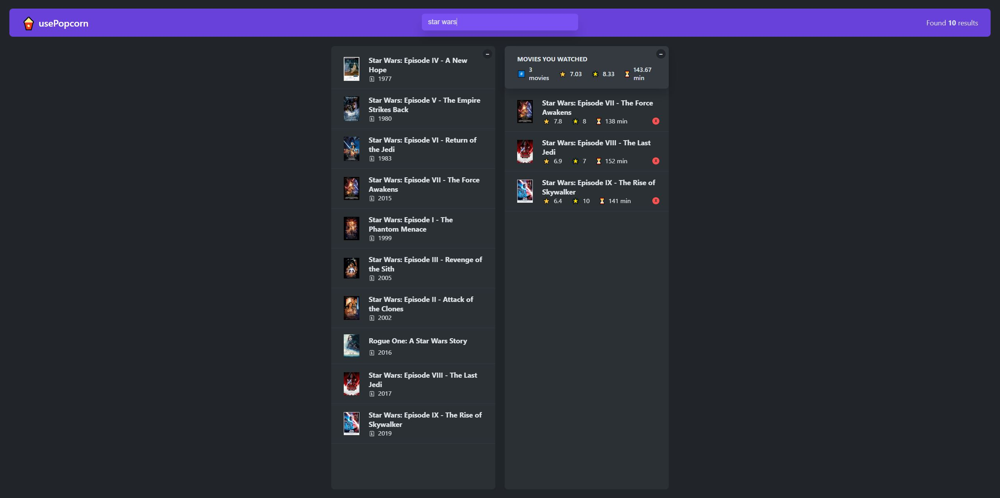

# usePopcorn 🍿

Welcome to **usePopcorn** – a movie search and management application built with React! This project allows you to search for movies, view details, and manage a list of watched movies with your personal ratings. It showcases dynamic data fetching, state management, and a responsive UI.

## Features

- **Movie Search**: Search for movies using keywords and fetch results from the OMDb API.
- **Movie Details**: View detailed information for each movie, including title, release date, genre, IMDb rating, and more.
- **Watched List**: Add movies to a watched list with your personal rating, movies that are saved to local storage for persistence.
- **Statistics**: Get an overview of watched movies with average IMDb and user ratings.
- **Responsive Design**: Enjoy a seamless experience across devices of all sizes.

## Demo

Check out the live version:

[https://use-popcorn-milotaieduards-projects.vercel.app/](https://use-popcorn-milotaieduards-projects.vercel.app/)

## Technologies Used

- **React** – for building UI components and managing application state
- **CSS** – for styling and responsive design

## Installation

To run this project locally, follow these steps:

1. Clone this repository:
   `git clone https://github.com/MilotaiEduard/usePopcorn.git`

2. Navigate to the project folder:
   `cd usePopcorn`
3. Install dependencies:
   `npm install`
4. Start the development server:
   `npm start`

The application will open on `http://localhost:3000`.

## Project Structure

- `/src`: Contains the main components and logic for handling list operations.
- `/public`: Stores static assets like images.
